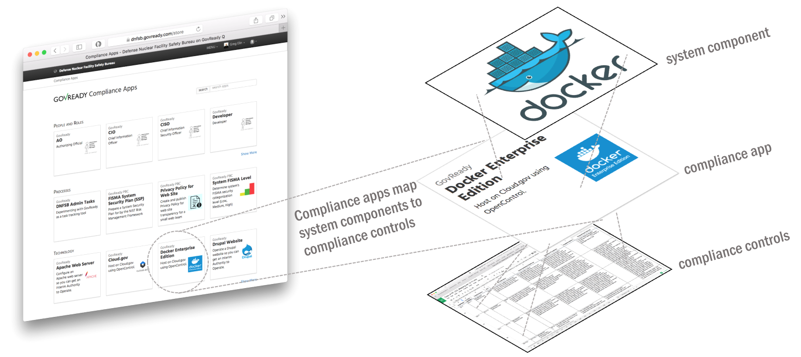

.. Copyright (C) 2020 GovReady PBC

.. _Introduction:

Introduction
============

Why GovReady-Q?
---------------

.. raw:: html

   <!-- Compliance is a huge value-add for organizations because it scales trust. "Certified" means tested and approved. When pace and scale of an activity reaches a certain critical point, increases, quality assurance by individuals must be replaced with compliance regimes on risk/reward themselves risk assessment with compliance regimes... 

   For too many organizations, compliance has become the main bottleneck---the primary constraint---on the pace of innovation. Their staff experiences assessments, documentation, and audits as exasperating, invisible work holding back their ability to deliver new value.
   -->

Everything about developing and deploying software is
accelerating…except for compliance. Why? Because:

-  maintaining written documentation is too slow,
-  pondering how jargon-laden control guidance applies is too hard,
-  there’s little reuse, and no compliance documentation supply chain.

To stop needing months to authorize systems that deploy in minutes,
assessments and authorizations need to be assembled from vetted,
pre-fabricated components sourced from the same software supply chain
with which we assemble applications.

How GovReady-Q Accelerates Compliance
-------------------------------------

GovReady accelerates compliance through component-centric guidance,
pre-written documentation, and collaboration.

**When you use or install GovReady-Q, you gain access to a marketplace
of small, self-service compliance apps written by peers and vendors that
map system components to security controls and guide you step-by-step
through assessments and documentation.**

   Apps map components to security/compliance controls

As you and your teammates collaboratively answer questions, the
compliance apps work with GovReady-Q to store your data in a relational
database and automagically generate and maintain your compliance
artifacts for auditors.

GovReady-Q’s contribution to Compliance-as-Code is the data abstractions
for shareable, reusable, and customizable packages—*Compliance Apps*—to
map the relationship between a system component and a set of controls.
The approach is innovative, yet familiar. Compliance Apps:

-  enable a hub/marketplace for community contributions;
-  extend inherited controls model to each system component;
-  enable modern, user-friendly experiences;
-  support agile, iterative workflows.

.. ATTENTION:: GovReady-Q software is “Beta” software best suited for
   early adopters needing faster compliance for DevSecOps.

.. raw:: html

   <!-- GovReady-Q accelerates compliance by tackling the data management challenges of compliance. GovReady-Q does not scan servers or end-points. (Lots of tools do that.) Instead, GovReady-Q makes it easy to trace the relationship between system components and security control descriptions and evidence. 

   GovReady-Q is open source GRC (Governance Risk & Compliance) platform for self-service preparation of compliance artifacts. It's ultra-friendly to use and ultra-compatible with Agile/DevOps Software Development Life Cycle.
   -->

GovReady-Q Philosophy
---------------------

**Compliance is not security. Compliance scales security.**

Compliance is a technique humans have developed for enabling trust in
systems that are too large and complex for individuals to assess
trustworthiness. Compliance scales participation, attestation and
verification of recommended practices.

-  We love security and innovation and believe they enable each other.
-  We believe security and compliance are standard, not premium add-ons.
-  We view compliance as a by-product of a well-instrumented process.
-  We value ease-of-use to increase adoption.
-  We value automation to increase consistency.
-  We see virtualization and DevOps enabling massive gains in security
   and compliance.

Documentation
-------------

The official GovReady-Q documentation is maintained at
`govready-q.readthedocs.io <https://govready-q.readthedocs.io/>`__.

Support
-------

Commercial support for GovReady-Q is provided by GovReady PBC. Email
info@govready.com.

Sign up for Security Notifications email list at `GovReady Security
Alerts <http://eepurl.com/dsi9YL>`__.

Reporting Bugs & Issues
-----------------------

Please file bug reports on our `GitHub
issue <https://github.com/GovReady/govready-q/issues>`__. When reporting
a bug, please include as much information as possible. This includes:

-  Install type: Hosted, Local, Docker, etc
-  URL
-  Action taken
-  Expected result
-  Actual result
-  Screenshot (if relevant)

License / Credits
-----------------

This repository is licensed under the `GNU GPL
v3 <https://github.com/GovReady/govready-q/blob/master/LICENSE.md>`__.

-  Emoji icons by http://emojione.com/developers/.
-  Generic server icon by `Stock Image Folio from Noun
   Project <https://thenounproject.com/search/?q=computer&i=870428>`__.

About GovReady PBC
------------------

GovReady PBC is a Public Benefit Corporation whose mission is to lower
the cost of innovation in digital services to citizens. GovReady’s
innovative self-service IT compliance tool GovReady-Q was developed as
part of an R&D contract to automate and lower the cost of cyber security
compliance from the Department of Homeland Security, Science and
Technology Directorate, Cyber Security Division. GovReady PBC is based
in the greater Washington, DC metro area.
