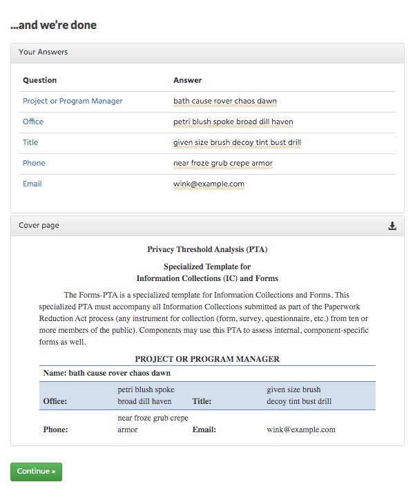
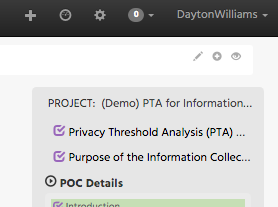
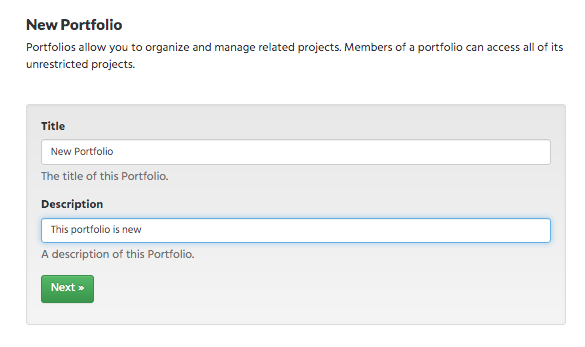

.. Copyright (C) 2020 GovReady PBC

.. _Login/Start/Logout:

Login/Start/Logout
==================

As a User, I am able to access the GovReady URL
-----------------------------------------------

The GovReady URL can be entered into your browser’s address bar. If the
URL is correct and the system is running, GovReady’s login page should
be visible. If the login page does not appear, check to make sure that
the URL is correct.

As a User, I am able to login to the GovReady application
---------------------------------------------------------

A User can login to GovReady software by navigating to the “Sign in”
flag on the right side of the screen. Enter the Username and Password
and click the “Sign in” button to login to the application.

**Sign In Page**

See Video Demonstration, `Here
<https://vimeo.com/418918695>`_.

What do I see when I login?
~~~~~~~~~~~~~~~~~~~~~~~~~~~

Once logged in, the User will be brought to the main “Projects” page. If
this is the first time a User signs on, there should be no active
projects. The User’s username should be visible at the top right of the
screen and match the User’s login name.

**Projects Page**

If unable to login, what do I do?
~~~~~~~~~~~~~~~~~~~~~~~~~~~~~~~~~

If a User inputs incorrect login credentials, the User will not proceed
to the “Projects” page and will display an error banner.

**Error Banner, Sign In**

Check the User’s credentials and try again. If the User has not yet
created an account, navigate to the “Register” flag to create a GovReady
account. The User will need to input a valid email address, an original
username, a password, and a personal portfolio. The personal portfolio
allows for Users to store assessments linked to a username.

**Register on Sign In Page**

If the User needs to reset their password, click on the link titled
“Forgot Password?” and enter the User’s email to receive and email with
a link to reset the User’s password. [NEED SIGN IN]

How to Invite Users to Questionnaire?
-------------------------------------

To invite others Users to a Questionnaire, the User must navigate to the
specific Questionnaire that the User wishes to invite other Users
access. The User may either create a new Project or select from the
Project screen an already created Project.

Once in the desired Project, the User should navigate to the grey
“Invite” button located on the right side of the screen.

Once clicked, a window will appear on the Project screen that allows the
User to invite a colleague to join the project’s team. The User is able
to select the recipient of the invitation by choosing from the drop down
menu. The drop down menu will list all other Users associated with the
system who have an account within the User’s organization. If the User
wishes to invite a colleague to join the project’s team from outside,
the User should select the option “Invite someone new by email...” from
the dropdown menu. Once selected, the menu will switch to “Invite by
Email” where the User can enter the email address of the colleague
outside of the project. The User is able to include a message about why
the User is sending the invitation. The User can enter a message within
the text below the drop down menu.

**Invitation Screen**

Once the desired recipient user (or their email if User selected “Invite
someone new by email...”) is selected from the drop down menu and the
invitation message is complete, the User can send the invitation by
clicking on the green “Invite” button. Once submitted, the invitation
window will close.

See Video Demonstration, `Here
<https://vimeo.com/418918750>`_.

How to Start a Discussion?
--------------------------

Discussions in GovReady are linked to specific questions within
Questionnaires. To start a discussion in GovReady, navigate to a
question by entering a module within a Project. Below a question there
is a “Discuss” button, the User clicks the button to enable the
commenting functionality. Users can add and format text, attach a file,
and tag other users in their comments by typing “@username”.

**Comment Example**

See Video Demonstration, `Here
<https://vimeo.com/418918489>`_.

How to Sign out?
----------------

To sign out of the GovReady application, navigate to the top right
portion of the screen. To the right of the username, click the small
downward facing arrow. From the drop down menu, select the “Log Out”
option to sign out.

**Sign Out Drop Down Menu**

See Video Demonstration, `Here
<https://vimeo.com/418918695>`_.

Questionnaire
=============

A questionnaire, also known as an assessment, is one of the core
building blocks of GovReady software. Questionnaires allow users to
answer questions and store those answers to be used in other parts of a
system’s project. Once a User is within an active project, the User can
switch between modules (which are collections of questions) in order to
complete a questionnaire.

How to start a Module?
----------------------

To start a module, simply click on the module’s white box. If a module
has not been started, the grey box in the module will show “Start
section”. The green bar within the module’s white box will show the
progress of the module’s completion. If a module is complete, the grey
box in the module will show “Finished”.

**Modules**

See Video Demonstration, `Here
<https://vimeo.com/418918489>`_.

How to View an Artifact?
------------------------

Artifacts are the final deliverables that are generated at the
conclusion of modules and assessments. To see a module’s artifact, click
on the “...and we’re done” text at the bottom of the module’s taskbar.

**Module Task Bar**

Once clicked, the User will be directed to the final page in that
module’s assessment. There the module’s artifact will be visible beneath
the module’s answer summary.

**End of Module**

How to Download an Artifact?
----------------------------

To download an Artifact, click on the downward facing arrow icon on the
top right of the artifact window. This action will open the Download
Document window; select the desired download format and click on the red
“Download” button.

**Download Window**

How to Edit existing Answers?
-----------------------------

To edit existing answers, simply navigate to a previously answered
questions and change the answered content. Once altered, click on the
green “Next >>” icon to lock in any edits.

How to Navigate between Questions?
----------------------------------

To navigate between questions, a User has several options. A User can
click on the green
“Next >>” icon to move to the next question in the module’s sequence. A
User can manually click on questions in the module task bar on the right
of the screen. In generated documents, answers that come from questions
a User answered can be navigated to by clicking on the answer in the
on-screen artifact and clicking on the name of the question found in the
pop-op box.

**Artifact Navigation**

How to Save Existing Work?
--------------------------

Any edited questions or answers are saved automatically once a User
clicks on the green
“Next >>” icon.

Can I Add, Edit, Delete Questions?
----------------------------------

If a User has the “Project Owner” permissions, a User can add, edit, and
delete questions. In application, adding, editing, and deleting
questions is managed through the authoring window which can be opened by
clicking on the pencil shaped icon on the top right hand corner of the
screen. To learn more about authoring original content, **consult our
Content Authoring Guide.**

**Authoring Tool, icon**

**The Authoring Tool**

Can I Review Questions?
-----------------------

Users can review the answers to questions by clicking on the “...and
we’re done” text at the bottom of the module’s taskbar. The answers to
all questions from that module will be displayed under the “Your
Answers” window.

Can I Freeze/Lock a Questionnaire?
----------------------------------

Currently, there is not a means to Freeze/Lock a questionnaire. However,
there are permissions in place that can be set by the project owner that
can prevent certain users from editing, changing, or deleting a
questionnaire, in effect locking the questionnaire from changes.

How do I Clear an answer?
-------------------------

There are a variety of ways to “clear an answer”. A user can delete
their text answer and type a single space to publish a blank answer. If
a User either does not know the answer to a question or finds for some
reason the question does not apply to the module, the User can delete
the text in the answer box and select either the “I don’t know” or “It
doesn’t apply” icons, respectively.

**Clear Answer Options**

Can I Delete a Questionnaire?
-----------------------------

If a user has the proper permissions to delete content, the User would
navigate to the relevant question, open the authoring tool, and select
the “Delete Question” button at the bottom of the tool window.

**Authoring Tool, Bottom Options**

How to Answer Questions?
------------------------

Questions are subdivided by question types. Answers may require short or
long text answers, selection or choice answers, or even uploading files.

**Possible Question Types**

.. figure:: assets/image22.png
   :alt: Possible Question Types

The content of a User’s answer should reflect the information collection
standards that the User’s organization utilizes. Include as much
relevant information as possible. Incomplete or sparse answers may cause
an organization to fail a compliance process.

How to answer a GovReady Data Grid question type?
----------------------------------------------------

The GovReady Data Grid question type is used to collect complex information from users on a single questionnaire page. To answer a GovReady Data Grid question type, click the green plus "+" at the top right of the grid, enter relevant information, and then click on the lower green plus "+" to add that information to the grid. Users can add multiple rows by clicking the lower green plus "+" again. Click on the "next question" button to save answers.

See Video Demonstration, `Here
<https://vimeo.com/418917502>`_.

How to answer a GovReady boilerplate template?
-----------------------------------------------

User content authors can create questions that generate pre-filled out to make navigating through a module's questions easier. This content will vary from organization to organization. A boilerplate template allows a user to accept the template as is, edit the template, or write original content.

See Video Demonstration, `Here
<https://vimeo.com/418916949>`_.

How to use the GovReady Authoring Tool?
----------------------------------------------

GovReady offers an in-app authoring functionality that enables users with certain permissions to change content within GovReady questionnaires. To access the Authoring Tool, click on the pencil icon at the top right of the questionnaire page. The authoring tool window will open on the right side of the screen. From the interface, users can change content, question type, and other facets of the questionnaire. Click "save" to save the changes on the questionnaire.

See Video Demonstration, `Here
<https://vimeo.com/418916771>`_.

Portfolios
==========

Can I Start a New Portfolio?
----------------------------

A User can start a Portfolio by navigating from the homepage to the
“Portfolios” page by either clicking on “Portfolios” on the navigation
bar at the top of the screen or by clicking on “Create a Portfolio” on
the Projects page.

**Create a Portfolio**

To start a new portfolio, simply add a Title and Description and click
on the green “Next” button.

**New Portfolio**

Creating a new Portfolio will bring to the Portfolio’s project page.

**Portfolio Project Page**

See Video Demonstration, `Here
<https://vimeo.com/418918431>`_.

How to Find my Portfolios?
--------------------------

A User can find all active portfolios by clicking on the “Portfolios”
button on the toolbar at the top of the screen.

**Find Portfolios**

.. figure:: assets/image25.png
   :alt: Find Portfolios

How do I Assign a User to become an Owner of a Portfolio?
---------------------------------------------------------

Grant access to a portfolio to another User by clicking on the green
“Grant access to member” button on a Portfolio’s Project page. **See
Portfolio Project Page above** .Once in the Portfolio menu, at the bottom
of the screen all Users with Access are made visible. Click on the red
and green buttons to remove or make owner of a user.

**Users with Access**

.. How can I Edit my Portfolio Name?
.. ---------------------------------

.. [NOT YET IMPLEMENTED]

.. How can I Delete my Portfolio?
.. ------------------------------

.. [NOT YET IMPLEMENTED]

.. How do I Grant/Remove access for another User to a Portfolio?
.. -------------------------------------------------------------

.. [NOT YET IMPLEMENTED]

Project
=======

How to Find my Project?
-----------------------

A User can find projects by clicking on the “Projects” link on the tool
bar at the top of the screen.

**Find Project**

.. figure:: assets/image5.png
   :alt: Find Project

Can I Start a new Project?
--------------------------

Once in the Projects page, a User can start a project by clicking on the
green “Start a Project” button.

**Start a Project**

How do I Leave a Project?
-------------------------

A User can leave a project whenever they desire by clicking on the
“Projects” link on the toolbar or anywhere that would navigate the user
elsewhere. The project’s progress will be saved automatically.

How do I Delete a Project?
--------------------------

A User can delete a Project by navigating to the Project clicking on the
“Settings” option on the toolbar at the right side of the screen. The
Project Settings window will appear. At the bottom of the Project
Settings window is a “Delete Project” button. This button will delete
the selected Project.

See Video Demonstration, `Here
<https://vimeo.com/418917707>`_.

Can I Rename Projects’ Names?
-----------------------------

A User can rename a Project by navigating to the Project clicking on the
“Settings” option on the toolbar at the right side of the screen. The
Project Settings window will appear. At the top of the Project Settings
window is an “Edit” button to the right of the Project’s name. This
button will allow the user to rename the Project.

Email/Notifications
===================

Email functionality
-------------------

Before Users can take advantage of email functionality, the system admin
will need to set up and configure the email system to GovReady software.
Users will receive emails when they are invited to a project or
portfolio and when they are tagged in a discussion thread.

Application Settings
====================

Can I Update my Profile?
------------------------

Users can update their profile by clicking on the Username on the top
right of the screen and clicking on Account Settings.

**Account Settings**

Once on the account settings page, Users can navigate through a module
where the User’s account name, role, title, picture, and favored chat
application can be edited/changed.

**Account Setting Module**

Using the API
=============

Using the API: e.g., API Keys
-----------------------------

Users can see the system’s API and API keys associated with their
profile by clicking on the Username on the top right of the screen and
clicking on “Your API Keys”.

**Your API Keys**

See Video Demonstration, `Here
<https://vimeo.com/418916528>`_.

App Sources
=============

Creating an App - ADVANCED
-----------------------------

GovReady allows organizations to create original apps for their own projects. Examples of premade apps can be found on GovReady's GitHub `here
<https://github.com/GovReady/Lightweight_ATO_template/tree/master/apps/light-ato-apps>`_.

Disclaimer: GovReady app creation is a more advanced procedure that is not recommended for inexperienced users.

For app creation, the app.yaml file is the "table of contents" for the app. Create an app.yaml file by creating a YAML file mirroring the example in the video below or by copying and editing an existing YAML file from the above GitHub link. 

Once an app.yaml is created, the user can create module files to replicate processes and create questionnaires for the system.

See Video Demonstration, `Here
<https://vimeo.com/418917112>`_.

For more emergent app design, it is possible to hide and reveal apps and questionnaires based on conditional statements. 

See Video Demonstration, `Here
<https://vimeo.com/418917770>`_.

Adding an App Source
-----------------------------

To add an app source to a running version of GovReady, navigate to the application's admin page. This will vary depending on your organization's deployed instance of GovReady. On the admin page, navigate to "App Sources". If you are adding a new app source, name the new app source in the "slug" section and select the path of the app source. GovReady supports local paths as well as paths from GitHub. Save the app source by clicking "Save" at the bottom of the page. Next, click on your newly added app source. In the "Compliance App" section at the bottom of the screen, select the version number of your desired app and click "Save". The new app source should be available at the "Projects" page.

See Video Demonstration, `Here
<https://vimeo.com/418916589>`_.
